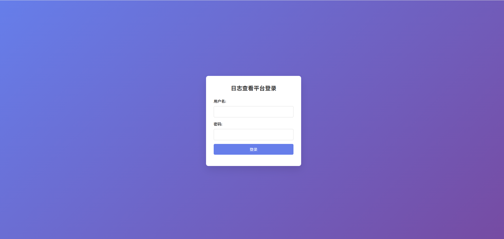
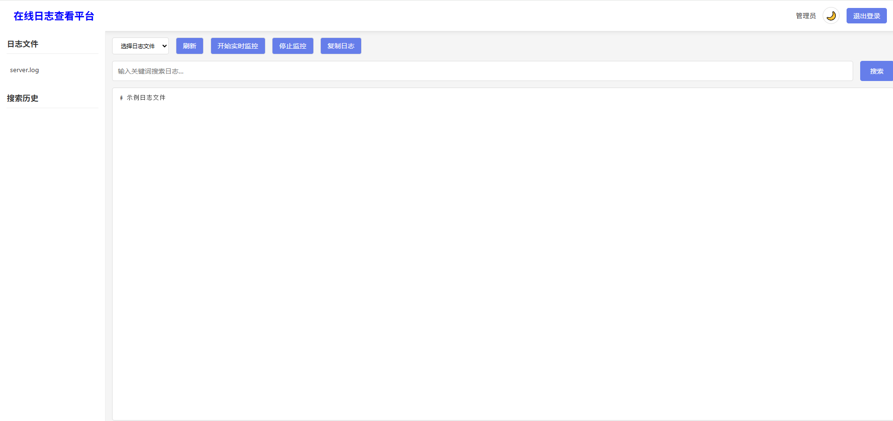

# 在线日志查看平台

一个基于 Node.js 的在线日志查看和分析平台，支持实时监控、关键词搜索、认证等功能。

# 功能介绍

## 登录页面
登录页面用于用户认证，只有通过认证的用户才能查看日志文件。


## 主页面
主页面显示当前选中的日志文件内容，并提供实时监控、关键词搜索和认证功能。


## 功能特性

1. **可配置的日志文件位置** - 支持自定义日志目录和主文件
2. **实时日志查看** - 通过 WebSocket 实现实时日志监控
3. **关键词搜索与分析** - 支持按关键词搜索日志并提取分析
4. **认证体系** - 账号密码认证后才能查看日志
5. **搜索历史记录** - 本地保存搜索历史，方便回溯

## 安装与运行

### 环境要求

- Node.js >= 14.0.0
- npm 或 yarn

### 安装步骤

1. 克隆项目代码：
   ```
   git clone <repository-url>
   cd log-view
   ```

2. 安装依赖：
   ```
   npm install
   ```

3. 启动服务：
   ```
   npm start
   ```
   
   或开发模式运行：
   ```
   npm run dev
   ```

4. 访问应用：
   打开浏览器访问 `http://localhost:3000`

## 默认账户

- 用户名：`admin`
- 密码：`123456`

## 配置说明

配置文件位于 [config.js](config.js)，可以修改以下配置：

- 服务器端口
- 认证信息（用户名、密码、JWT密钥等）
- 日志目录和主文件路径
- 历史记录存储路径

## 使用说明

1. **登录系统**：使用默认账户登录
2. **选择日志文件**：从左侧文件列表或顶部下拉框选择要查看的日志文件
3. **查看日志**：系统会自动显示所选文件的内容
4. **实时监控**：点击"开始实时监控"按钮，实时查看日志更新
5. **搜索日志**：在搜索框中输入关键词，点击"搜索"按钮查找相关日志
6. **查看历史**：在左侧"搜索历史"面板中查看之前的搜索记录
7. **退出登录**：点击右上角"退出登录"按钮

## 技术栈

- 后端：Node.js + Express + Socket.IO
- 前端：原生 HTML + CSS + JavaScript
- 认证：JWT + bcrypt
- 数据存储：文件系统（JSON格式存储历史记录）

## 目录结构

```
log-view/
├── config.js           # 配置文件
├── server.js           # 服务端入口文件
├── package.json        # 项目依赖配置
├── public/             # 前端静态资源
│   ├── index.html      # 主页面
│   ├── styles.css      # 样式文件
│   └── app.js          # 前端逻辑
├── logs/               # 默认日志目录
└── data/               # 数据存储目录
```

## 安全说明

1. 系统使用 JWT 进行身份验证
2. 密码经过 bcrypt 加密存储
3. 文件访问限制在配置的日志目录内
4. 建议在生产环境中修改默认账户密码

## 扩展功能

如需扩展功能，可以考虑：

1. 添加多用户支持和权限管理
2. 支持日志文件上传
3. 添加日志分析图表
4. 支持正则表达式搜索
5. 添加日志导出功能